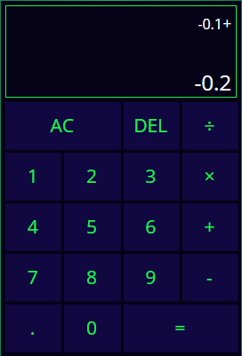

# Calculator #

[DEMO](https://gleb-bayeshko.github.io/calculator/) ------>

## Technology stack ##
* **HTML**
* **CSS/SASS** *(SCSS)*:
  * Folders and files architecture,
  * Final main.scss file with imports of all other files,
  * Some animations (with keyframes and JavaScript);
* **JavaScript** *(ECMAScript 6/7/8)*:
  * Render all elements on page (initial index.html file is empty except for the basic html structure),
  * Module (import/export),
  * Class,
  * Destructuring assignment,
  * Arrow functions,
  * Rest parameters,
  * Spread syntax and etc.
* **Webpack** *(webpack.config.js)*:
  * Plugins,
  * Loaders,
  * Modes (dev/prod),
  * Final bundle.

## Functionality ##
1. Basic calculations:
  - Addition
  - Subtraction
  - Multiplication
  - Division
1. Actions with fractional numbers;
1. Input of negative numbers;
1. All-clear button;
1. Delete button:
  - Delete numbers one at time,
  - Delete operator if input is empty and move pervious result to the input area;