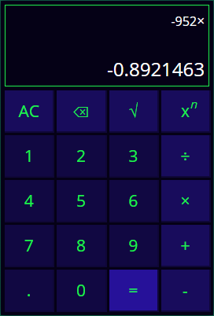

# Calculator #

## Technology stack ##
* **HTML**
* **CSS/SASS** *(SCSS)*:
  * folders and files architecture,
  * final main.scss file with imports of all other files,
  * some animations (with keyframes and JavaScript);
* **JavaScript** *(ECMAScript 6/7/8)*:
  * render all elements on page (initial index.html file is empty except for the basic html structure),
  * module (import/export),
  * class,
  * destructuring assignment,
  * arrow functions,
  * rest parameters,
  * spread syntax and etc.
* **Webpack** *(webpack.config.js)*:
  * plugins,
  * loaders,
  * modes (dev/prod),
  * final bundle.

## Functionality ##
- Basic calculations:
  - addition,
  - subtraction,
  - multiplication,
  - division;
- Additional calculations:
  - square root extraction,
  - exponentiation;
- Actions with fractional numbers;
- Input of negative numbers;
- Exception handling:
  - division by zero,
  - square root a negative number,
  - other mistakes;
- All-clear button;
- Delete button:
  - delete numbers one at time,
  - delete operator if input is empty and move pervious result to the input area;
- All-clear button.
